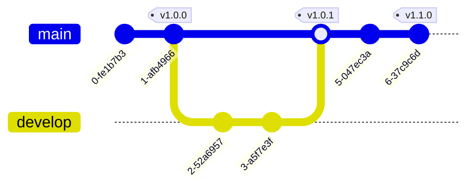

# Git基础知识

---

# Git的重要概念
理解Git的理论与精髓

- 阶段/区 (Stage)
  - __工作区 (working directory)__，本地工作区，文件的状态又可以分为：Untrack (未追踪)，Unmodified (未被修改)， Modified (已修改)  {v-click}
  - __暂存区 (Staging area)__，代提交到仓库的暂存区域，可以理解为一个临时区域，可以撤销，可以提交到仓库快照。 {v-click}
  - __仓库 (Repository)__，历史快照存储区域，所有的修改已被追踪和固化。 {v-click}

---

# Git的重要概念
理解Git的理论与精髓

---

# Git的重要概念
理解Git的理论与精髓

<ul>
    <li v-click>提交 (commit)，git会为每一个修改提交生成一个SHA-1的哈希字符串，commit是每一次提交的唯一标识（ID）</li>
    <li v-click>标签 (tag)，因为SHA-1哈希字符串很难记忆，所以标签tag应运而生，tag跟commit是一样的，可以理解为commit的别名。</li>
    <li v-click>分支 (branch)，分支是一个commit链表的表头，跟tag一样，也是为了方便记住commit历史中的某个节点。</li>
</ul>

---

# Git的重要概念
理解Git的理论与精髓

---

# Git的重要概念
理解Git的理论与精髓

参考:

https://git-scm.com/book/zh/v2/Git-%e5%9f%ba%e7%a1%80-%e8%8e%b7%e5%8f%96-Git-%e4%bb%93%e5%ba%93

