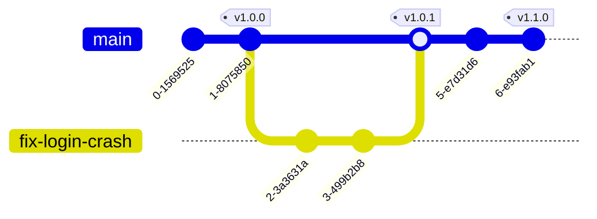

# Git基础知识

---

# Git简介
Git的诞生与优缺点介绍

## 诞生

Git之父就是大名鼎鼎的linux祖师爷Linus Torvalds. 由于他不满于之前的版本控制软件Bitkeeper的功能，以及该工具需要付费license，于是连夜手搓了一个后来统一天下的版本控制软件Git。

## Git优点

1. 可离线使用，不需要借助网络，即可实现代码的提交以及修改回退。
2. 支持多人协助同时开发，支持多分支开发。
3. 合并修改非常容易。
4. 强一致性检查。git内部通过SHA1哈希，blob对象，tree对象保证仓库可可靠性，防止代码仓库崩溃。

---

# Git的重要概念
理解Git的理论与精髓

- 阶段/区 (Stage)
  - __工作区 (working directory)__，本地工作区，文件的状态又可以分为：Untrack (未追踪)，Unmodified (未被修改)， Modified (已修改)  {v-click}
  - __暂存区 (Staging area)__，代提交到仓库的暂存区域，可以理解为一个临时区域，可以撤销，可以提交到仓库快照。 {v-click}
  - __仓库 (Repository)__，历史快照存储区域，所有的修改已被追踪和固化。 {v-click}

---

# Git的重要概念
理解Git的理论与精髓


---

# Git的重要概念
理解Git的理论与精髓

<ul>
    <li v-click><span class="text-blue-600">提交 (commit)</span>，git会为每一个修改提交生成一个SHA-1的哈希字符串，commit是每一次提交的唯一标识（ID）</li>
    <li v-click><span class="text-blue-600">标签 (tag)</span>，因为SHA-1哈希字符串很难记忆，所以标签tag应运而生，tag跟commit是一样的，可以理解为commit的别名。</li>
    <li v-click><span class="text-blue-600">分支 (branch)</span>，分支是一个commit链表的表头，跟tag一样，也是为了方便记住commit历史中的某个节点。</li>
</ul>

---

# Git常用命令


---

# Git常用命令


---

# Git常用命令
汇总常用命令

| 命令 | 作用 |
|---|---|
| git init | 初始化文件夹为git工作区, git会在工作区中，创建一个.git文件夹 |
| git status | 查看工作区的状态 |
| git log | 查看仓库的提交历史 |
| git add <目录或文件> | 添加文件或目录到暂存区（待提交） |
| git commit | 提交修改到仓库，常用参数 -m 后跟commit的备注；-a 添加已被追踪的文件到暂存区 |
| git rm <目录或文件> | 从仓库中删除文件; 常用参数：--cache 只删除仓库的缓存，不实际删除文件 |
| git tag <标签> | 给当前的commit打上标签 |
| git checkout <分支> | 切换或创建分支，常用参数: -b 创建分支，不加则表示切换分支 |
| git branch | 查看分支，常用指令: --delete 删除分支 |
| git merge <分支> | 合并制定分支到当前分支 |
---

# Git常用命令
汇总常用命令 (远程仓库相关)

| 命令 | 作用 |
|---|---|
| git clone <远程仓库地址> | 复制克隆远程仓库到本地 |
| git pull [远程仓库名] | 同步拉取远程仓库的修改到本地，并合并修改到本地仓库 |
| git fetch [远程仓库名] | 只同步远程仓库的修改到本地，不修改本地仓库 |
| git push <远程仓库名> [远程仓库分支] | 推送更新到远程仓库 |

---

# Git使用场景案例
理解Git的理论与精髓



此处描述了一个开发协助场景:

* 研发部门的张三，负责android app的研发:

1. 项目被创建, 提交了第一个commit0
2. 需求点1开发完成，提交第二个commit1
3. 需求点2正在开发中，尚未提交commit

---

# Git使用场景案例
理解Git的理论与精髓


客户技术支持部门李四，收集到了客户反馈的app登录时崩溃信息，要求立刻修复app的崩溃问题，否则引起客户流失。任务被分配到黄五，于是黄五就连夜加班修复问题：

1. 黄五首先创建了一个新的分支`fix-login-crash`，修改了源码，提交了一次commit2 (SHA1: 8e6892c)
2. 黄五进行了第一轮测试，发现仍然有问题，再修改并提交了第二次commit3 (SHA1: 03e37e32)
3. 此时测试通过，黄五需要把紧急修复的bug合并会`main`主分支，并打上标签`v1.0.1`
4. 黄五通过CI工具，执行app的构建，并自动打包上传apk，并推送更新通知给终端用户。

---

# Git使用场景案例
案例的时序图 (张三)


---

# Git使用场景案例
案例的时序图 (李四)


---

# Git使用场景案例
张三使用的命令

<ul>
<li v-click>
  创建git仓库

  ```shell
  git init
  ```
</li>
<li v-click>
  提交第一个commit0

  ```shell
  # 添加文件到暂存区
  git add .
  # 提交暂存区修改到仓库
  git commit -am 'feat: 初始化项目'
  ```
</li>
<li v-click>
  提交第二个commit1

  ```shell
  git add .
  git commit -am 'feat: 完成需求1功能'
  ```
</li>
<li v-click>
  打标签v1.0.0

  ```shell
  git tag v1.0.0
  ```
</li>
<li v-click>
  推送远程仓库

  ```shell
  git remote add origin git@github.com:org1/project1.git
  git push -u origin main
  git push --tags
  ```
</li>
</ul>

---

# Git使用场景案例
李四使用的命令

<ul>
<li v-click>
  拉取远程仓库到本地

  ```shell
  git clone git@github.com:org1/project1.git
  ```
</li>
<li v-click>
  创建fix-login-crash分支

  ```shell
  git checkout -b fix-login-crash
  ```
</li>
<li v-click>
  提交第一个commit2, commit3

  ```shell
  git add .
  git commit -am 'feat: 修复登录失败问题'
  ```
</li>
<li v-click>
  合并fix-login-crash到main分支

  ```shell
  git checkout main
  git merge fix-login-crash
  ```
</li>
<li v-click>
  打上v1.0.1标签

  ```shell
  git tag v1.0.1
  ```
</li>
<li v-click>
  推送远程仓库

  ```shell
  git push origin main
  git push --tags
  ```
</li>
</ul>

---

# Git使用参考书籍与文献
理解Git的理论与精髓

参考:

* https://git-scm.com/book/zh/v2/Git-%e5%9f%ba%e7%a1%80-%e8%8e%b7%e5%8f%96-Git-%e4%bb%93%e5%ba%93
* https://liaoxuefeng.com/books/git/introduction/index.html
* https://zhuanlan.zhihu.com/p/32357954114
