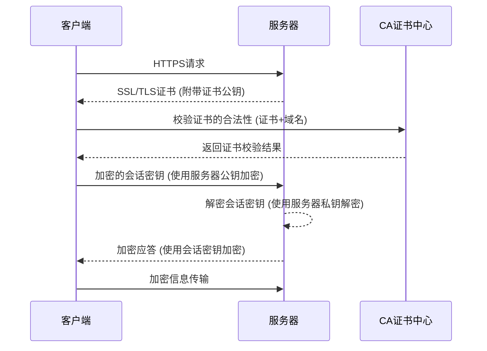

# 计算机网络


---

# TCP/IP协议
互联网的底层核心

<div class="flex justify-center">
    
</div>

---

# TCP/IP协议
互联网的底层核心

TCP/IP协议是一个分层协议，由四层协议组成，分别是: {v-click}

<ul>
<li v-click><span class="text-green-700">应用层</span>，给操作系统应用提供通信协议，包括浏览器，邮件客户端，应用层协议包括HTTP, FTP, DNS, SMTP等</li>
<li v-click><span class="text-blue-700">传输层</span>，负责解决两台电脑的进程之间如何通信的问题，核心协议包括TCP协议和UDP协议</li>
<li v-click><span class="text-red-700">网络层</span>，负责在不同网络之间如何路由的问题，核心就是IP地址和IP协议</li>
<li v-click><span class="text-purple-700">数据链路层</span>，负责物理网络之间通信的协议，例如Wi-Fi无线传输，以太网有线传输</li>
</ul>

---

# HTTP协议
Web和Restful的传输协议

<span class="text-blue-700">HTTP协议</span>，全称是Hypertext Transfer Protocol，即超文本传输协议，HTTP/1.1是一个以文本为编码方式的传输协议。也就是我们可以通过文本编辑器可以直接查看协议内容。

<div class="flex flex-row gap-1">

<div class="flex-1" v-click>

客户端请求

```
GET / HTTP/1.1
Host: www.example.com
User-Agent: Mozilla/5.0
Accept: text/html,application/xhtml+xml
Accept-Language: en-GB,en;q=0.5
Accept-Encoding: gzip, deflate, br
Connection: keep-alive
```

</div>

<div class="flex-1" v-click>

服务器响应

```html
HTTP/1.1 200 OK
Date: Mon, 23 May 2005 22:38:34 GMT
Content-Type: text/html; charset=UTF-8
Content-Length: 155
Last-Modified: Wed, 08 Jan 2003 23:11:55 GMT
Server: Apache/1.3.3.7 (Unix) (Red-Hat/Linux)
Accept-Ranges: bytes
Connection: close

<html>
<head>
    <title>An Example Page</title>
</head>
<body>
    <p>Hello World, this is a very simple HTML document.</p>
</body>
</html>
```

</div>

</div>
---

# HTTP/1.1协议
协议组成部分解析

HTTP/1.1协议请求有如下部分组成:

* 请求行(Request line)

    ```
    [方法 METHOD] [请求路径 URI] [版本号]
    GET /index.html HTTP/1.1
    ```

* 请求头 (Headers)

    采用键值对key-value形式，每行一个键值对，通过CRLF换行

    ```
    [键 Key]: [值Value]
    Content-Type: application/json
    ```

* 空行
* 消息体（可选）
  
  GET请求不能包含消息体，其余方法均可以附带消息体。常用格式包括form-url-encoded, json, plaintext

---

# HTTP/1.1请求方法

* GET，表示获取某个路径的资源
* HEAD，类似GET请求，但是不要需要消息体
* POST，语义表示创建资源
* PATCH，语义表示修改资源的部分状态或属性
* PUT，语义表示替换资源的状态或属性
* DELETE，语义表示删除资源
* OPTION，查询HTTP URL支持的方法

---

# HTTP/1.1消息体
HTTP的消息体支持多种格式，都以文本形式传输

* 表单 (`Content-Type=application/x-www-form-urlencoded`)

  ```
  name=John+Doe&email=john.doe%40example.com&message=Hello+world%21
  ```

* HTML (`Content-Type=text/html`)
  
    ```
    <html>
        <body><p>Hello world</p></body>
    </html>
    ```

* JSON (`Content-Type=application/json`)
  
    ```json
    {"code": 0, "message": "success", "data": [{"id": 1, "name": "张三"}, {"id": 2, "name": "李四"}]}
    ```

* XML (`Content-Type=application/xml`)

    ```
    <xml>
        <root>root</root>
    </xml>
    ```

---

# HTTPS 超文本传输安全协议
客户端与服务器端的HTTP消息加密协议

由于HTTP的文本特性，传输双方的数据以文本方式传输，可以被第三者看到，为了解决通信双方数据的安全性，HTTPS应运而生。

* 传输数据的加密。加密使用对称加密，例如AES, 3DES。
* 密钥的交换，使用非对称加密，例如RSA，通信双方交换密钥后，本次通信都是用相同的密钥传输，通信结束后，密钥丢弃。
* 身份验证，服务端有一个公钥，客户端需要获取到公钥后，到CA证书中心验证公钥跟域名是否匹配，如果匹配则说明服务端是合法的。

---

# HTTPS 超文本传输安全协议
客户端与服务器端的HTTP消息加密协议

<div class="w-[60%]">



</div>