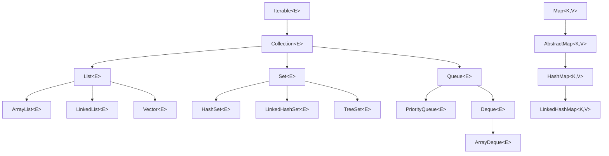

# 集合框架

<p></p>

集合框架统一了如何访问一组数据。集合有如下优势

* 💦 简化我们开发人员的工作量，使用系统提供的集合类实现一组数据的管理
* ⚡️ 提高复用性，更高的效率，更优化的算法
* 🔌 统一了访问和修改的接口，例如获取列表获取统一使用`get`, 添加统一使用`add`

---

# 集合框架



- 列表接口List，提供有序元素存储与访问的接口
- 无序集合Set，提供访问无序且不能重复集合的接口
- 队列Queue，提供有优先级的队列的访问接口，例如先进先出
- 字典Map, 提供键值对访问的接口

---

# Collection 接口

- Collection 是一个根接口，我们常用其子接口（如 List）的实现类，例如 ArrayList

```java
import java.util.ArrayList;
import java.util.Collection;

public class CollectionExample {
public static void main(String[] args) {
        Collection<String> collection = new ArrayList<>(); // 创建Collection实例

        collection.add("Apple"); // 添加元素
        collection.add("Banana");
        collection.add("Orange");
        collection.add("Apple"); // 允许重复

        System.out.println("集合元素:");
        for (String fruit : collection) { // 遍历集合
            System.out.println(fruit);
        }

        System.out.println("集合大小: " + collection.size());  // 其他操作
        System.out.println("包含Banana: " + collection.contains("Banana"));
}
```

---

<div v-click style="margin-top: 15px; border-left: 5px solid #3498db; background: #f0f8ff; padding: 10px 15px; border-radius: 4px; display: inline-block;width: 800px;">
练习：创建一个Collection集合，添加5个数字，遍历并计算它们的总和
</div>

---

```java
import java.util.ArrayList;
import java.util.Collection;

public class Main {
    public static void main(String[] args) {
        Collection<Integer> numbers = new ArrayList<>();
        numbers.add(10);
        numbers.add(20);
        numbers.add(30);
        numbers.add(40);
        numbers.add(50);

        int sum = 0;
        for (Integer num : numbers) {
            sum += num;
        }
        System.out.println("总和: " + sum);
    }
}
```

---

# List接口和ArrayList类

<div class="flex flex-row gap-4">
    
    <div class="flex">
    <ul>
        <li>List接口，定义了访问集合内部元素的方法，例如添加元素add, 根据下标获取元素get</li>
        <li>ArrayList是一个类，实现了List接口，需要实现List接口的所有方法</li>
        <li>ArrayList有一个属性elementData，指向的是外部的一个数组，数组的长度是基于构造函数提供的。数组负责存储实际的元素数据。</li>
        <li>ArrayList内部实现了自动根据实际元素的多少，自动重新创建新的底层数组。</li>
    </ul>
    </div>
</div>

---

# ArrayList

```java
import java.util.ArrayList;
import java.util.List;

public class ListExample {
    public static void main(String[] args) {
        List<String> list = new ArrayList<>(); // 创建List实例

        list.add("Java"); // 添加元素
        list.add("Python");
        list.add("C++");
        list.add(1, "JavaScript"); // 在指定位置插入

        System.out.println("第二个元素: " + list.get(1));  // 访问元素
        System.out.println("Python的位置: " + list.indexOf("Python"));

        list.set(2, "Go");  // 修改元素

        System.out.println("列表元素:");
        for (int i = 0; i < list.size(); i++) { // 遍历列表
            System.out.println((i + 1) + ". " + list.get(i));
        }
    }
}
```

---

<div style="margin-top: 15px; border-left: 5px solid #3498db; background: #f0f8ff; padding: 10px 15px; border-radius: 4px; display: inline-block;width: 800px;">
练习：创建一个String类型的List，添加5个名字，找出最长的名字并打印
</div>

---

```java
import java.util.ArrayList;
import java.util.List;

public class Main {
    public static void main(String[] args) {
        List<String> names = new ArrayList<>();
        names.add("Alice");
        names.add("Bob");
        names.add("Christopher");
        names.add("David");
        names.add("Emma");

        String longestName = "";
        for (String name : names) {
            if (name.length() > longestName.length()) {
                longestName = name;
            }
        }
        System.out.println("最长的名字: " + longestName);
    }
}
```

---

# Set 接口

- 常用实现类：HashSet

```java
import java.util.HashSet;
import java.util.Set;

public class SetExample {
    public static void main(String[] args) {
        Set<String> set = new HashSet<>(); // 创建Set实例

        set.add("Apple");  // 添加元素（自动去重）
        set.add("Banana");
        set.add("Orange");
        set.add("Apple"); // 这个不会被添加

        System.out.println("Set元素:");
        for (String fruit : set) {  // 遍历集合
            System.out.println(fruit);
        }

        Set<String> otherSet = new HashSet<>(); // 集合操作
        otherSet.add("Banana");
        otherSet.add("Grape");

```

---

```java
        Set<String> union = new HashSet<>(set);  // 并集
        union.addAll(otherSet);
        System.out.println("并集: " + union);

        Set<String> intersection = new HashSet<>(set);  // 交集
        intersection.retainAll(otherSet);
        System.out.println("交集: " + intersection);
    }
}

```

<div v-click style="margin-top: 15px; border-left: 5px solid #3498db; background: #f0f8ff; padding: 10px 15px; border-radius: 4px; display: inline-block;width: 800px;">
练习：创建两个Set集合，分别包含一些数字，找出它们的交集和并集
</div>

---

```java
import java.util.HashSet;
import java.util.Set;
import java.util.Arrays;

public class Main {
    public static void main(String[] args) {
        Set<Integer> set1 = new HashSet<>(Arrays.asList(1, 2, 3, 4, 5));
        Set<Integer> set2 = new HashSet<>(Arrays.asList(4, 5, 6, 7, 8));

        // 交集
        Set<Integer> intersection = new HashSet<>(set1);
        intersection.retainAll(set2);
        System.out.println("交集: " + intersection);

        // 并集
        Set<Integer> union = new HashSet<>(set1);
        union.addAll(set2);
        System.out.println("并集: " + union);
    }
}

```

---

# Map接口和HashMap类

<p></p>

<div class="text-gray-600 my-1">
📕 字典是一种类似我们英文词典的一种数据接口，例如我们需要查<span class="text-red-500">hello</span>这个英文单词的意思。
</div>

* 通过英文字典的目录查找hello这个单词，
* 跳到目录指定的一页然后找到单词对应的一页
* 并查看单词的详细解释。

---

# Map接口和HashMap类

<div class="flex flex-row gap-4">
    
    <div class="flex">
    <ul>
        <li>🔌 Map接口，定义了基于键值对的访问和存储接口，如添加键值对put, 基于键获取值get</li>
        <li>📚 HashMap类实现了Map接口，基于哈希计算+数组+链表数组实现字典。</li>
        <li>🔍 例如查找hello单词，首先计算单词的哈希值8491，并把哈希值转成数组下标</li>
        <li>🎉 找到链表的首个节点，返回“你好”</li>
    </ul>
    </div>
</div>

---

# HashMap

```java
import java.util.HashMap;
import java.util.Map;

public class MapExample {
    public static void main(String[] args) {
        Map<String, Integer> studentScores = new HashMap<>();  // 创建Map实例

        studentScores.put("Alice", 95); // 添加键值对
        studentScores.put("Bob", 88);
        studentScores.put("Charlie", 92);
        studentScores.put("Alice", 98); // 更新Alice的分数

        System.out.println("Alice的分数: " + studentScores.get("Alice")); // 获取值

        System.out.println("学生成绩:");
        for (Map.Entry<String, Integer> entry : studentScores.entrySet()) { // 遍历Map
            System.out.println(entry.getKey() + ": " + entry.getValue());
        }

        System.out.println("包含David: " + studentScores.containsKey("David"));  // 检查键值是否存在
        System.out.println("包含分数100: " + studentScores.containsValue(100));

```

---

```java
        System.out.println("所有学生: " + studentScores.keySet()); // 获取所有键和值
        System.out.println("所有分数: " + studentScores.values());
    }
}

```

<div v-click style="margin-top: 15px; border-left: 5px solid #3498db; background: #f0f8ff; padding: 10px 15px; border-radius: 4px; display: inline-block;width: 800px;">
练习：创建一个Map，存储商品名称和价格，找出价格最高的商品
</div>

---

```java

import java.util.HashMap;
import java.util.Map;

public class Main {
    public static void main(String[] args) {
        Map<String, Double> products = new HashMap<>();
        products.put("Laptop", 1200.0);
        products.put("Phone", 800.0);
        products.put("Tablet", 500.0);
        products.put("Headphones", 150.0);

        String mostExpensive = "";
        double maxPrice = 0;
        for (Map.Entry<String, Double> entry : products.entrySet()) {
            if (entry.getValue() > maxPrice) {
                maxPrice = entry.getValue();
                mostExpensive = entry.getKey();
            }
        }
        System.out.println("最贵的商品: " + mostExpensive + " - $" + maxPrice);
    }
}

```

---

# Iterator 接口

```java
import java.util.ArrayList;
import java.util.Iterator;
import java.util.List;

public class IteratorExample {
    public static void main(String[] args) {
        List<Integer> numbers = new ArrayList<>(); // 创建列表
        numbers.add(10);
        numbers.add(20);
        numbers.add(30);
        numbers.add(40);
        numbers.add(50);

        Iterator<Integer> iterator = numbers.iterator(); // 获取迭代器

        System.out.println("使用迭代器遍历:");
        while (iterator.hasNext()) {
            Integer number = iterator.next();
            System.out.println(number);

            if (number > 30) {  // 删除大于30的元素
                iterator.remove();
            }
        }

```

---

```java
        System.out.println("删除后的列表: " + numbers);

        Iterator<Integer> iterator2 = numbers.iterator(); // 使用forEachRemaining (Java 8+)
        System.out.println("使用forEachRemaining:");
        iterator2.forEachRemaining(System.out::println);
    }
}

```

<div v-click style="margin-top: 15px; border-left: 5px solid #3498db; background: #f0f8ff; padding: 10px 15px; border-radius: 4px; display: inline-block;width: 800px;">
练习：创建一个List包含一些字符串，使用Iterator删除所有长度小于3的字符串
</div>

---

```java

import java.util.ArrayList;
import java.util.Iterator;
import java.util.List;

public class Main {
    public static void main(String[] args) {
        List<String> words = new ArrayList<>();
        words.add("Hi");
        words.add("Hello");
        words.add("Java");
        words.add("OK");
        words.add("No");

        Iterator<String> iterator = words.iterator();
        while (iterator.hasNext()) {
            String word = iterator.next();
            if (word.length() < 3) {
                iterator.remove();
            }
        }
        System.out.println("处理后的列表: " + words);
    }
}

```
