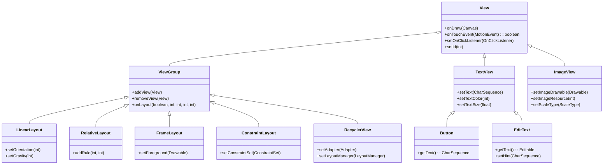

# Android组件总揽



<v-clicks>

* 所有组件的都是继承自`View`类，`View`类负责图形的绘制和事件的处理。
* 容器组件的父类都继承自`ViewGroup`类。
* 容器组件负责管理子组件的定位以及尺寸，<span class="text-blue-500">容器组件</span>是不可见的。

</v-clicks>

---

# Android的常用单位

* <span class="text-blue-700">dp (Density-independent Pixels)</span>，设备无关的像素大小。
* <span class="text-blue-700">sp (Scale-independent Pixel)</span>，性质类似于dp，但是同时受用户设置的影响。一般作为文字大小的设置单位。

假如，我们使用固定像素大小的一个按钮 (323像素 x 50像素)，如果在一个低分辨率的手机上，显示效果如下左图所示；但是在高分辨率的手机上，显示效果如下右图所示，按钮的比例跟低分辨率手机上相比，比例显得很小。

<div class="flex flex-row gap-2 text-red-600 items-center">
    
    
    <div v-click class="">为了解决不同手机尺寸带来的问题，安卓引入了 <strong>dp</strong> 的概念，组件的大小自动根据不同的分辨率计算实际的像素</div>
</div>

---

# Android组件的通用属性 - 高度宽度

| 属性 | 作用 | 说明 |
|-|-|-|
| android:layout_width | 组件宽度 | 1. match_parent: 占满父节点的大小; 2. wrap_content: 包裹内容，内容有大，该节点就有多大; 3. 自定义大小 |
| android:layout_height | 组件高度 | 取值同上 |

<div class="flex flex-row gap-2 text-red-600 items-center mt-3">
    
    
</div>

---

# Android组件的通用属性 - 外边距

| 属性 | 作用 | 说明 |
|-|-|-|
| android:layout_margin | 组件外边距 | 设置上下左右的外边距，例如20dp |
| android:layout_marginTop | 组件外上边距 | 设置外上边距，例如10dp |
| android:layout_marginLeft | 组件外左边距 | 设置外上边距，例如30dp |
| android:layout_marginRight | 组件外右边距 | 设置外上边距，例如40dp |
| android:layout_marginBottom | 组件外下边距 | 设置外上边距，例如50dp |

<div class="flex flex-row gap-2 text-red-600 items-center mt-3">
    
</div>

---

# Android组件的通用属性 - 内边距

| 属性 | 作用 | 说明 |
|-|-|-|
| android:layout_padding | 组件内边距 | 设置上下左右的外边距，例如20dp |
| android:layout_paddingTop | 组件上内边距 | 设置外上边距，例如10dp |
| android:layout_paddingLeft | 组件左内边距 | 设置外上边距，例如30dp |
| android:layout_paddingRight | 组件右内边距 | 设置外上边距，例如40dp |
| android:layout_paddingBottom | 组件下内边距 | 设置外上边距，例如50dp |

<div class="flex flex-row gap-2 text-red-600 items-center mt-3">
    
</div>

---

# Android组件的通用属性

| 属性 | 作用 | 说明 |
|-|-|-|
| android:id | 组件ID | 为组件添加ID，后续可以在代码中引用该组件，例如@+id/button |
| android:background | 背景 | 设置组件的背景，可以是图片或者颜色 |
| android:visibility | 是否可见 | 设置组件是否可见。visible：可见; invisible: 不可见; gone: 不绘制，不占用空间 |
| android:layout_gravity | 父组件中如何定位 | center: 在父组件中居中, bottom: 在父组件的底部, top: 父组件顶部，或其他 |
| android:alpha | 透明度 | 设置透明度0~1之间的小数， 0: 完全透明; 1: 完全可见 |

---

# 在代码中访问组件

1. 为组件添加ID属性: `android:id="@+id/text_view"`
2. `findViewById`，在代码中调用这个方法，可以获取到组件的对象，该方法接受一个组件ID的属性
3. 访问组件的方法或属性

```java
public void onCreate() {
    TextView tv = findViewById(R.id.text_view);
    tv.setText("Hello world");
}
```
