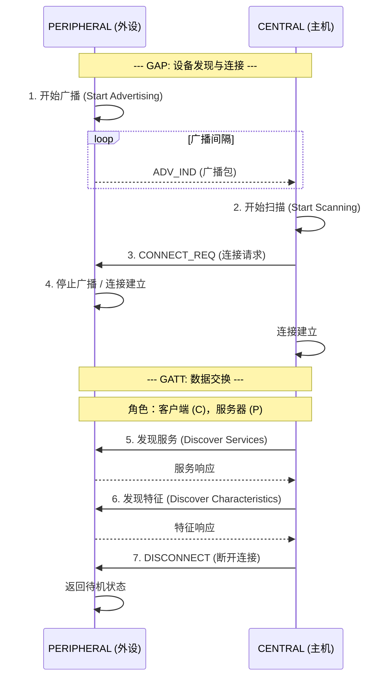
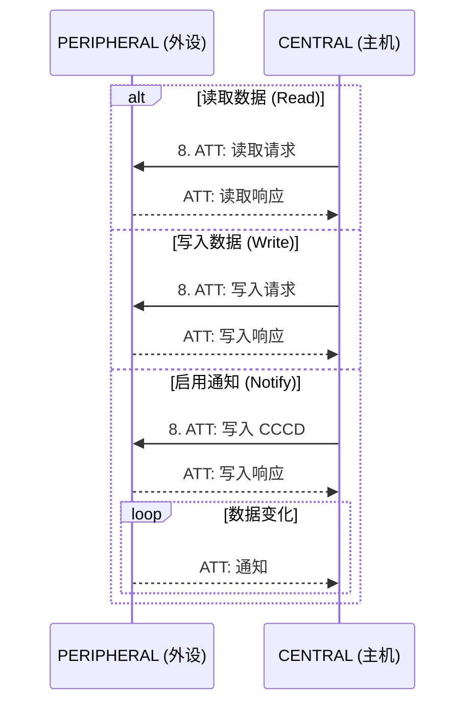

# 蓝牙通信基础支持
Android 提供支持传统蓝牙和蓝牙低功耗 (BLE) 的默认蓝牙堆栈。

* 经典蓝牙（Classic bluetooth）：追求数据吞吐量，适用于需要持续传输大量数据的场景，如音频、文件传输。

* 低功耗蓝牙（BLE）：追求低功耗和极简连接，适用于偶尔传输少量数据的物联网设备。

---

# 经典蓝牙 vs. 低功耗蓝牙对比表

| 特性 | 经典蓝牙 | 低功耗蓝牙 |
| :--- | :--- | :--- |
| **核心目标** | 持续稳定的**高速数据**传输 | **极低功耗**，间歇性小数据量传输 |
| **功耗** | 高 | **极低**（硬币电池可工作数月甚至数年） |
| **峰值功率** | 约 1 W | 约 0.01 - 0.5 W |
| **数据传输速率** | **高**（1-3 Mbps，蓝牙 3.0+HS 更高） | **低**（理论 1-2 Mbps，实际有效吞吐量更低） |
| **连接延迟** | 较高（通常需数百毫秒） | **极低**（可在几毫秒内建立连接） |
| **通信拓扑** | 主要是**点对点** | **点对点、广播（一对多）、Mesh** |
| **数据广播** | 不支持 | **核心功能**，设备可主动广播信息 |
| **典型应用场景** | 音频传输（耳机、音箱）、文件传输、车载免提 | 物联网、穿戴设备、信标、遥控器、智能传感器 |
| **协议栈复杂度** | 复杂，协议层多 | **简单**，设计轻量 |
| **设备发现时间** | 较长（约 1-2 秒） | 非常短（约几毫秒） |
| **关键协议/规范** | A2DP, HFP, HSP, SPP | GATT, ATT |

---

# 低功耗蓝牙 (BLE)
低功耗蓝牙的基本要素与概念介绍

## 🙋 角色

* 主机 (Central)，可以连接多个从机外设，主动发起对外设的连接
* 外设（Peripheral），可以发起广播，接受来自主机的连接与双向通信，例如手环，温度计

## 🗳️ 服务 (Service)

一组相关的数据集合，组合起来描述一类功能，例如手环的心率服务；一般外设都会广播帧中包含有一个主服务，用于告知主机，外设是什么类型的产品。

## 💾 特征 (Characteristic)

实际存储数据的属性，例如心率值，每个特征还有一个属性(properties)，描述该特征的读写性质，例如可读，可写，可订阅。

---

# 蓝牙连接流程

    

    <ol>
        <li>设备开始广播</li>
        <li>主机开始扫描附近的蓝牙设备</li>
        <li>主机发起设备的连接请求</li>
        <li>连接成功，设备停止广播</li>
        <li>发现服务</li>
        <li>发现特征</li>
        <li>断开连接</li>
    </ol>

---

# 蓝牙数据读写的流程

    <ul>
        <li>读取操作(READ)需要由主机主动发起</li>
        <li>写入操作(WRITE)同样需要由主机主动发起</li>
        <li>主机可以订阅特征的变化</li>
        <li>主机订阅特征后，外设的特征可以在变化时，主动通知主机 (Notify)</li>
    </ul>

---

# Android蓝牙API

* `BluetoothManager`: 管理设备的连接状态，获取蓝牙适配器`BluetoothAdapter`
* `BluetoothAdapter`: 表示本地蓝牙适配器，可以打开关闭蓝牙；获取本地蓝牙设备的信息
* `BluetoothLeScanner`: 低功耗蓝牙的扫描器，可以执行扫描和停止扫描
* `BluetoothDevice`: 蓝牙外设设备类，可以创建和关闭连接，执行配对
* `BluetoothGatt`: 获取服务，特征的读写；订阅特征变化
* `BluetoothGattService`: 管理服务下的特征
* `BluetoothGattCharacteristic`: 特征类，存储具体的属性值，获取读写订阅属性