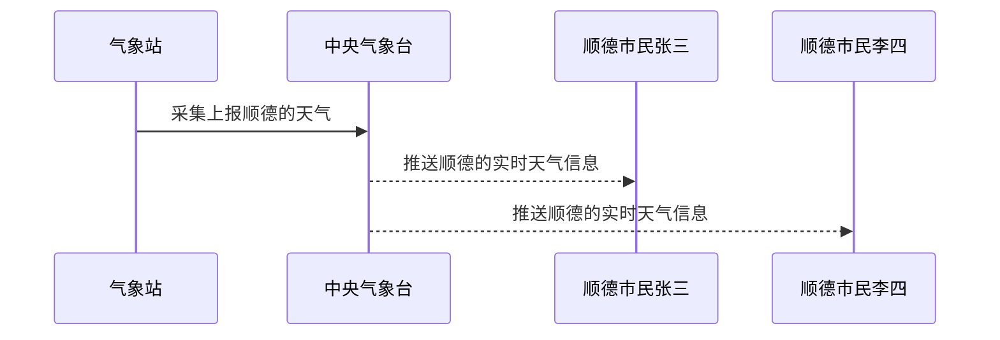

# Broadcast Receiver简介

broadcast receiver做为四大组件之一，负责组件之间消息的传递和接收。

系统会在发生各种系统事件时自动发送广播，例如当系统进入和退出飞行模式时。所有已订阅的应用都会收到这些广播。

* 采用观察者模式，基于消息的发布/订阅事件模型，通过Binder机制进行消息的注册和接收。

* 广播中的角色：

  1. 消息订阅者（广播接收者）

  2. 消息发布者（广播发布者）

  3. 消息中心（AMS，即Activity Manager Service）

---

# 消息订阅模式

以下天气预报为例解析什么是消息订阅模式:



---

# 发布订阅者模式的优势

  1. 📢 消息的发布者无需关系有多少个订阅者
  2. ✉️ 订阅者可以订阅多个关心的事件
  3. 📪 消息中心负责连接发布者和订阅者
  4. 实现了系统的解耦合，使得系统扩展更容易，更灵活。

---

# 广播的种类

* 标准广播, 广播发出后，所有的消息订阅这BroadcastReceiver几乎同时收到广播消息，没有先后顺序，不能被截断。

  

* 有序广播，一种同步广播，同一时刻只能有一个BroadcastReceiver会收到消息，当它执行完逻辑后，会传递给下一个BroadcastReceiver。有序广播支持截断消息往下传播。

  

---

# 广播相关的函数与类
广播注册与发送相关的函数和类

动态注册需要使用的核心方法和类：

* `registerReceiver`, 注册广播的类型
* `unregisterReceiver`，取消注册广播
* `abortBroadcast`，截断广播，只能用于有序广播，截断后，后续的BroadcastReceiver将无法收到广播
* `sendBroadcast`, 发送标准广播
* `sendOrderedBroadcast`, 发送有序广播
* `Intent`, 设置需要监听的广播，支持监听多个广播

---

# 广播的注册
<p></p>

注册类型有两种：

* **静态注册**，通过预先把要监听的接收者注册到AndroidManifest文件中。
* **动态注册**，通过代码动态实现注册与移除。

---

# 静态注册

即在清单文件中注册

* 创建一个广播接收器BroadcastReceiver ，广播也是通过Intent来传递数据。

```java
public class MyBroadcastReceiver extends BroadcastReceiver {
  private final String TAG = "MyBroadcastReceiver";

  @Override
  public void onReceive(Context context, Intent intent) {
    if (Intent.ACTION_SCREEN_ON.equals(intent.getAction())) {
      Log.i(TAG, "屏幕亮起");
      Toast.makeText(context, "屏幕亮起", Toast.LENGTH_SHORT).show();
    } else if (Intent.ACTION_SCREEN_OFF.equals(intent.getAction())) {
      Log.i(TAG, "屏幕关闭");
      Toast.makeText(context, "屏幕关闭", Toast.LENGTH_SHORT).show();
    }
  }
}
```

---

# 静态注册
AndroidManifest清单文件注册该广播

```xml
    <!-- 注册系统广播 -->
    <receiver
      android:enabled="true"
      android:exported="true"
      android:name=".MyBroadcastReceiver"
      android:permission="android.permission.RECEIVE_BOOT_COMPLETED">
      <intent-filter>
        <action android:name="android.intent.action.BOOT_COMPLETED" />
        <action android:name="android.intent.action.QUICKBOOT_POWERON" />

        <category android:name="android.intent.category.DEFAULT" />
      </intent-filter>
    </receiver>
```

---

# 动态注册
以下例子注册了3个系统广播事件，分别是屏幕关闭，屏幕亮起，系统时间变化

```java
IntentFilter intentFilter = new IntentFilter();
// 动态注册时间变化
intentFilter.addAction("android.intent.action.TIME_TICK");
// 动态注册屏幕亮起广播
intentFilter.addAction("android.intent.action.SCREEN_ON");
// 动态注册屏幕关闭广播
intentFilter.addAction("android.intent.action.SCREEN_OFF");
// 注册广播接收者
registerReceiver(myBroadcastReceiver, intentFilter);
```

---

# 发送自定义广播
通过activity中的sendBroadcast方法实现发送广播

* 发送标准广播

```java
private void sendStandardBroadcast(){
  Intent intent = new Intent("com.enixyu.broadcastreceiverdemo.CUSTOM_STANDARD_BROADCAST");
  intent.setPackage(getPackageName());
  sendBroadcast(intent);
}
```

* 发送有序广播

```java
private void sendOrderedBroadcast() {
  Intent intent = new Intent("com.enixyu.broadcastreceiverdemo.CUSTOM_ORDERED_BROADCAST");
  intent.setPackage(getPackageName());
  sendOrderedBroadcast(intent, null);
}
```

---

# 有序广播的截断
通过在某个BroadcastReceiver中调用abortBroadcast, 实现截断，后续的广播接收者将无法收到广播

```java
public class CustomHighOrderedBroadcastReceiver extends BroadcastReceiver {

  private final String TAG = getClass().getSimpleName();

  @Override
  public void onReceive(Context context, Intent intent) {
    Log.d(TAG, "接收到自定义有序通知");
    Toast.makeText(context, "高优先级: 接收到自定义有序广播", Toast.LENGTH_LONG).show();
    if (intent.getBooleanExtra("interrupt", false)) {
      abortBroadcast();
    }
  }
}
```

---

# 取消动态注册广播
当不再使用广播时，需要取消注册，不然容易造成内存泄漏

```java
@Override
protected void onDestroy() {
	super.onDestroy();
	unregisterReceiver(myBroadcastReceiver);
}
```
