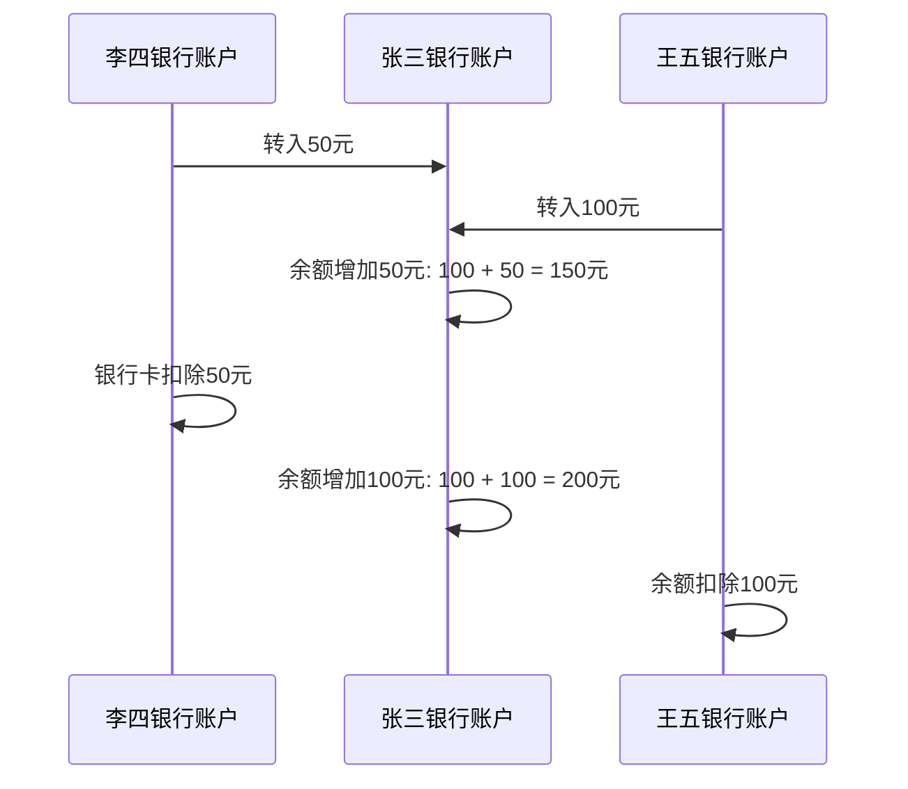

# 数据库的发展历史
介绍数据库的诞生与演变

### 1️⃣ 第一阶段，计算机出现前

📒 记录形式包括：账本、档案袋、文件柜、卡片索引

🤔 缺点：完全物理操作，查找靠手翻。数据冗余（同一份信息在多个本子里重复抄写）、容易出错、无法共享。

### 2️⃣ 第二阶段，萌芽时代 —— 文件系统（1950s-1960s）

📒 记录形式：数据保存在独立的文件里，例如`students.txt`， `grades.txt`

🤔 缺点：
* 数据冗余与不一致、
* 依赖性强：文件结构（比如列的顺序）一旦改变，所有读取它的程序都要重写。

---

# 数据库的发展历史
介绍数据库的诞生与演变

### 3️⃣ 关系型数据库革命 —— SQL的诞生（1970s）

一位IBM研究员发表了一篇论文提出了关系数据模型的概念。该模型基于数学的集合论。

* 数据以表格 (`Tables`) 的形式组织，每个表包含行和列。
* 表格之间通过通用属性（如`主键`和`外键`）建立关系。
* 用户使用结构化查询语言 (`SQL`) 来查询数据，只需说明想要什么数据，而无需指定如何存取。

1970年代末期，出现了第一个商业化的关系型数据库系统，如Oracle 1.0

### 4️⃣ 现代 —— 百花齐放（2000s 至今）

数据库世界不再是关系型一统天下，而是根据不同的“工作场景”选用不同的“工具”。

* 关系型 (SQL)
* 文档型 (NoSQL)，键值型 (NoSQL)
* 图数据库 (NoSQL)

---

# 关系型数据库RDBMS的特点

### 📚 1. 结构化数据存储 (表格化)

* 表 (Table)： 数据以二维表（也称为关系）的形式存储，类似于 Excel 表格。
* 行与列 (Row and Column)： 表由行（记录或元组）和列（属性）组成。每行代表一个独立的实体，每列代表该实体的某个属性。
* 统一结构： 每个表中的数据都遵循预先定义的严格模式 (Schema)，这意味着每列的数据类型和约束是固定的。

例如设计一个银行储户的信息表，结构如下

| 客户编号 (数字) | 姓名 (字符串) | 银行卡余额 (浮点数) |
|---|---|---|
| 1 | 张三 | 100.00 |
| 2 | 李四 | 2000.00 |
| 3 | 王五 | 50.00 |

---

# 关系型数据库RDBMS的特点

### 🔗 2. 基于关系理论的完整性约束

关系型数据库通过键（Keys）和约束（Constraints）来维护数据之间的关系和数据的有效性，这是保证数据正确性的关键。

* <span class="text-blue-700">主键 (Primary Key, PK)</span>： 每行都有一个唯一标识，不允许重复或为空，用于唯一确定表中的每一条记录。

* <span class="text-blue-700">外键 (Foreign Key, FK)</span>： 用于建立表与表之间的关联关系。外键引用另一个表的主键，确保数据之间的引用是有效的，维护了引用完整性。

* <span class="text-blue-700">其他约束</span>： 包括唯一性约束 (Unique)、非空约束 (NOT NULL) 和检查约束 (Check)，进一步保证数据的质量和有效性。

---

# 关系型数据库RDBMS的特点
假如对上述银行储户的信息表按照关系理论重新设计

#### <span class="text-blue-700">客户信息表</span>

| 客户编号 (数字) | 姓名 (字符串) |
|---|---|
| 1 | 张三 |
| 2 | 李四 |

<p />

#### <span class="text-red-700">银行卡表</span>

| 银行卡号 (字符串) | 客户编号 (外键) | 余额 |
|---|---|---|
| 62239319393939 | 1 | 801.32 |
| 62239319393931 | 2 | 10000.00 |
| 62239319393938 | 1 | 100.00 |

---

# 关系型数据库RDBMS的特点

### ✅ 3. 可靠的事务管理 (ACID 特性)

RDBMS确保了数据在并发和故障情况下的完整性和可靠性。 **事务（Transaction）** 是指一系列数据库操作的逻辑单元。RDBMS 保证这些操作满足 ACID 四大特性：

* <span class="text-blue-700">原子性(Atomicity)</span>:	一个事务中的所有操作，要么全部完成，要么全部不完成（回滚）。	确保操作的不可分割性。
* <span class="text-blue-700">一致性(Consistency)</span>:	事务执行前后，数据库必须保持一致状态（即满足所有预设的完整性约束）。	确保数据的正确性。
* <span class="text-blue-700">隔离性(Isolation)</span>:	多个并发事务彼此互不干扰，就好像它们是串行执行的一样。	确保并发操作的正确性。
* <span class="text-blue-700">持久性(Durability)</span>:	一旦事务提交（Commit），它对数据的改变就是永久的，即使系统发生故障也不会丢失。确保数据不会丢失。
---

# ACID举例
以银行卡转帐为例，假设有两个客户（分别是李四、王五）同时向同一个人（张三）的银行卡帐号转帐，假如张三的银行卡余额为100元

<div class="flex flex-row">

<div class="flex flex-1">



</div>

<div class="flex flex-1">

1. 李四向张三转50元
2. 王五想张三转100元
3. 张三银行卡原来余额为100元，增加来自李四50元后是150元
4. 假如另外一笔王五的转帐几乎同时发生，张三银行卡原来余额为100元，增加来自王五100元后是200元
5. ❌ 现在的张三的余额不是250元（100 + 50 + 100），而是错误的保存为200元。

</div>

</div>

---

# 关系型数据库RDBMS的特点

### 💬 4. 标准化查询语言 (SQL)

RDBMS 普遍使用结构化查询语言 (SQL) 作为其主要的交互和管理接口。

| 语句 | 作用 | 示例 |
|---|---|---|
| CREATE | 创建数据库或表等对象。 | CREATE TABLE Students (StudentID INT, Name VARCHAR(50)) |
| ALTER | 修改现有数据库对象的结构。| ALTER TABLE Students ADD Email VARCHAR(100) |
| DROP | 永久删除数据库中的表、索引或数据库。| DROP TABLE Students |

---

# 创建表CREATE TABLE
定义数据表的格式

```sql
CREATE TABLE [表名] (
  [字段1] [类型],
  [字段2] [类型],
  ...
);
```

SQLite支持的数据类型:

* `INTEGER` 整数
* `TEXT` 文本，不限制长度
* `REAL` 浮点数
* `BLOB` 二进制大对象，存储为原始的字节数据

```sql
CREATE TABLE student (
    id INTEGER PRIMARY KEY AUTOINCREMENT,  -- 学号，自动增长 sqlite 使用 AUTOINCREMENT，mysql 使用 AUTO_INCREMENT
    name TEXT NOT NULL,                    -- 姓名，不能为空
    age INTEGER,                           -- 年龄
    gender TEXT,                           -- 性别
);
```

---

# 查询数据SELECT
从数据表中查询数据

```sql
SELECT [字段1], [字段2], ... --- 指定需要选择哪些列
FROM [表名] -- 从哪个表选择数据
WHERE [条件1] AND [条件2]... -- 筛选的条件
```

* `=`: 等于，例如 `age = 21`
* `>`, `<`, `>=`, `<=`: 大于/小于/大于等于/小于等于，例如 `age > 21`
* `IN`: 列表查询，例如 `age IN (21, 22)`

举例

| id | name | age |
|---|---|---|
| 1 | 张三 | 20 |
| 2 | 李四 | 21 |
| 3 | 王五 | 23 |

<p />

```sql
SELECT * FROM student;  -- 返回所有行记录
SELECT name FROM student WHERE age >= 22;  -- 只返回了王五一条记录
```

---

# 添加数据INSERT
向数据表中写入新的数据

语法

```sql
INSERT INTO [表名] ([字段1], [字段2], ...)
VALUES ([字段1值], [字段2值], ...);
```

举例

```sql
INSERT INTO student (name, age) VALUES ('小明', 18); -- 往学生表里添加一条记录，姓名是小明，年龄18岁
```

---

# 修改数据UPDATE
修改现有的数据行记录

语法

```sql
UPDATE [表名]
SET [字段1] = [字段1值], [字段2] = [字段2值], ...
WHERE [筛选条件]
```

> 筛选条件与SELECT的WHERE语法一致，WHERE语句是可选的，如果不填则修改所有行记录。

举例

```sql
UPDATE student SET age = 19 WHERE name = '小明'; -- 把叫小明的学生年龄改成19
```

---

# 删除数据DELETE
从表中删除一行记录

语法

```sql
DELETE FROM [表名]
WHERE [筛选条件]
```

> 筛选条件与SELECT的WHERE语法一致，WHERE语句是可选的，如果不填则修改所有行记录。

举例

```sql
DELETE FROM student WHERE name = '小明'; -- 删除叫小明的学生记录
```

---

# 什么是sqlite数据库
SQLite，是一款轻型的数据库，它的设计目标是嵌入式的，而且已经在很多嵌入式产品中使用了它，它占用资源非常的低，在嵌入式设备中，可能只需要几百K的内存就够了。

### 1️⃣ 简单，无需安装。

SQLite 没有复杂的安装配置过程，不需要另外配置、安装或管理。不需要启动、停止或配置的服务器进程，无需创建新的数据库实例或为用户分配访问权限的“设置”过程。

### 2️⃣ 资源占用少。

SQLite占用空间非常小，是轻量级的，完全配置时小于600KiB，省略可选功能配置时小于250KiB，占用的电脑资源少，真正做到绿色、轻盈！

### 3️⃣ 处理速度快

SQLite比一些流行的数据库在大部分普通数据库操作要快！

---

# 作为Android 本地存储有什么优势

1. 效率高：查询和写入速度快。

2. 适合结构化数据：可存储用户信息、配置表、日志等。

3. 跨 Activity / 跨应用数据传递：数据库文件可直接访问。

4. 轻量级、无服务器：节省资源，不需要维护服务进程。

5. 可自由备份和复制：所有数据在一个文件中。

---

# SQLite数据类型

<div style="display: table; border-collapse: collapse; width: 100%;">

  <!-- 表头 -->
  <div style="display: table-row; background-color: #f0f0f0; font-weight: bold;">
    <div style="display: table-cell; border: 1px solid #ccc; padding: 8px;">类型</div>
    <div style="display: table-cell; border: 1px solid #ccc; padding: 8px;">描述</div>
  </div>

  <!-- 数据行：SQLite 实际支持 -->
  <div style="display: table-row;">
    <div style="display: table-cell; border: 1px solid #ccc; padding: 8px;">NULL</div>
    <div style="display: table-cell; border: 1px solid #ccc; padding: 8px;">空值类型。</div>
  </div>

  <div style="display: table-row;">
    <div style="display: table-cell; border: 1px solid #ccc; padding: 8px;">INTEGER</div>
    <div style="display: table-cell; border: 1px solid #ccc; padding: 8px;">整数类型，根据数值大小自动使用 1~8 字节存储。</div>
  </div>

  <div style="display: table-row;">
    <div style="display: table-cell; border: 1px solid #ccc; padding: 8px;">REAL</div>
    <div style="display: table-cell; border: 1px solid #ccc; padding: 8px;">浮点数类型，使用 8 字节 IEEE 754 格式存储。</div>
  </div>

  <div style="display: table-row;">
    <div style="display: table-cell; border: 1px solid #ccc; padding: 8px;">TEXT</div>
    <div style="display: table-cell; border: 1px solid #ccc; padding: 8px;">文本类型，以 UTF-8、UTF-16BE 或 UTF-16LE 格式存储。</div>
  </div>

  <div style="display: table-row;">
    <div style="display: table-cell; border: 1px solid #ccc; padding: 8px;">BLOB</div>
    <div style="display: table-cell; border: 1px solid #ccc; padding: 8px;">二进制数据，按输入的原始格式存储。</div>
  </div>

</div>
