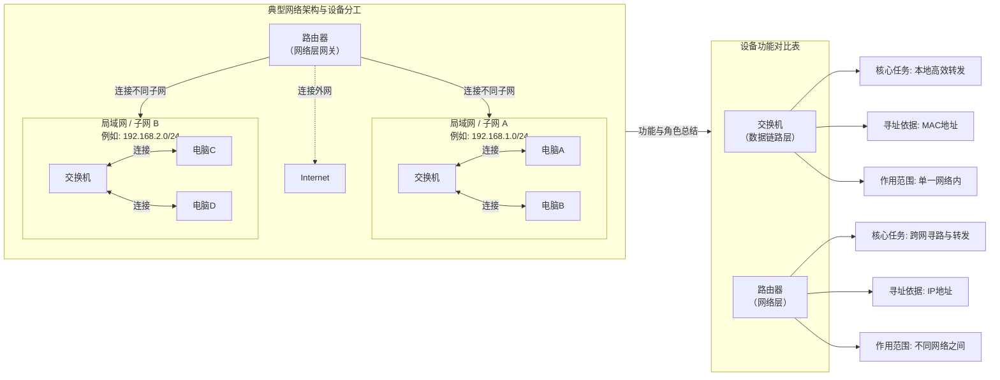
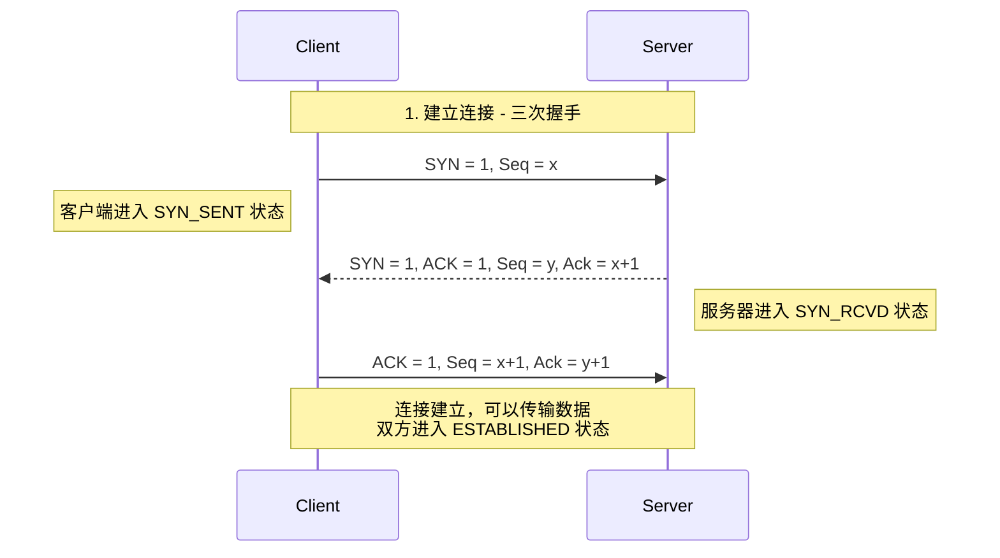
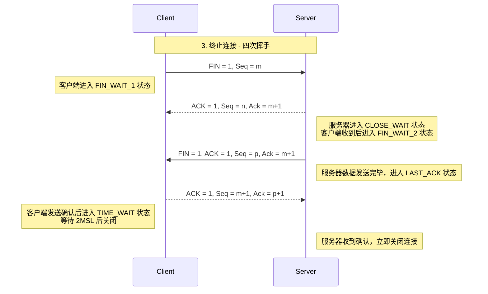

# 计算机网络

计算机网络解决是互联网中两台机器之间的数据传输问题。

1. 解决“连通性”问题：从孤岛到互联
2. 解决“资源共享”问题：从独占到共享，例如打印机的共享，网络存储
3. 解决“信息交换与传递”问题：从延迟到实时，例如电子邮件、即时通讯、视频会议
4. 解决“可靠性”与“可扩展性”问题：从脆弱到健壮
5. 解决“分布式计算与协作”问题：从单机到协同，例如集群计算、网格计算、云计算
6. 解决“安全与访问控制”问题：从开放到受控

---

# OSI七层网络模型

| 层级 | 名称 | 核心功能 | 关键协议/示例 | 典型设备 |
|:---:|:---|:---|:---|:---|
| 7 | 应用层 | 为应用程序提供网络服务接口，用户与网络的交互界面 | HTTP/HTTPS、FTP、DNS、SMTP、SSH | 应用程序本身（浏览器、邮件客户端） |
| 6 | 表示层 | 数据格式转换、加密/解密、压缩/解压缩 | SSL/TLS（加密）、JPEG、ASCII、Unicode | 网关（软件形式） |
| 5 | 会话层 | 建立、管理、终止应用程序间的会话/连接 | NetBIOS、RPC、PPTP、SIP | 网关（软件形式） |
| 4 | 传输层 | 提供端到端的可靠/不可靠传输，流量控制，差错恢复 | TCP（可靠）、UDP（不可靠） | 防火墙、网关（四层） |
| 3 | 网络层 | 逻辑寻址（IP）、路由选择、分组转发 | IP、ICMP、ARP、OSPF、BGP | 路由器、三层交换机 |
| 2 | 数据链路层 | 物理寻址（MAC）、帧封装、差错检测、介质访问控制 | 以太网、PPP、VLAN、MAC | 交换机、网桥、网卡 |
| 1 | 物理层 | 在物理介质上传输原始比特流，定义电气/物理特性 | RJ45、IEEE 802.3（有线）、IEEE 802.11（无线） | 集线器、中继器、网线、光纤 |

---

# TCP/IP协议

* 网络接口层，负责在物理链路上传输数据帧。处理与硬件接口、物理寻址（MAC地址）相关的细节。
* 网络层，基于IP寻址，实现跨网段的两台计算机之间的通信
* 传输层，解决一台机器中，不同应用程序之间的传输问题。一般基于端口来识别不同的应用程序。经典的传输层协议包括TCP, UDP
* 应用层，例如HTTP（万维网）/FTP（文件传输）/SMTP邮件协议

---

# 交换机与路由器
交换机与路由器的工作原理与区别

---

# IP协议
为互联网的每个终端赋予一个门牌地址

* IPv4, 使用32位地址来标识每个终端，约42亿个，点分十进制，如`192.168.1.1`
* IPv6, 128位地址，可以容纳更多的终端地址。

IP地址组成

* 网络号，通过IP地址中的子网掩码来确定网络部份的长度，例如`192.168.1.0/24`，网络号为: `192.168.1.0`
* 主机号

私有地址

| CIDR地址块 | 地址范围（起点 - 终点） | 传统地址类别对应 | 子网掩码（点分十进制） | 可用主机地址数量 |
| :--- | :--- | :--- | :--- | :--- |
| **10.0.0.0/8** | 10.0.0.0 - 10.255.255.255 | 1个A类网络 | 255.0.0.0 | 16,777,214 |
| **172.16.0.0/12** | 172.16.0.0 - 172.31.255.255 | 16个连续的B类网络 | 255.240.0.0 | 1,048,574 |
| **192.168.0.0/16** | 192.168.0.0 - 192.168.255.255 | 256个连续的C类网络 | 255.255.0.0 | 65,534 |

---

# TCP/IP协议封装与解封装
数据的装包与解包过程

---

# TCP协议

* 面向连接，建立连接需要3次握手
* 可靠传输，使用确认机制，保证数据送达
* 流量控制，通过滑动窗口，实现发送速度的控制
* 全双工通信，双方可以独立的进行收发数据

---

# TCP三次握手

---

# TCP四次挥手

---

# UDP协议

* 无连接，每个数据包独立处理
* 不可靠，没有重传机制，不保证送达、不保证顺序、不保证不重复。
* 无控制机制，无流量控制、拥塞控制、超时重传。
* 开销小，头部只有8个字节
* 可以实现多对多传输，可一对一、一对多、多对多（广播/组播）
